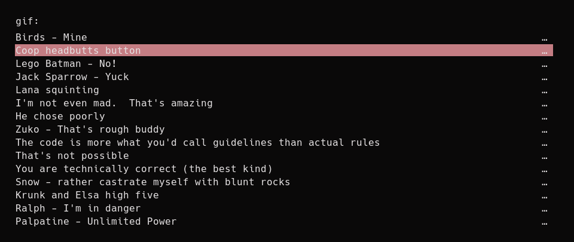
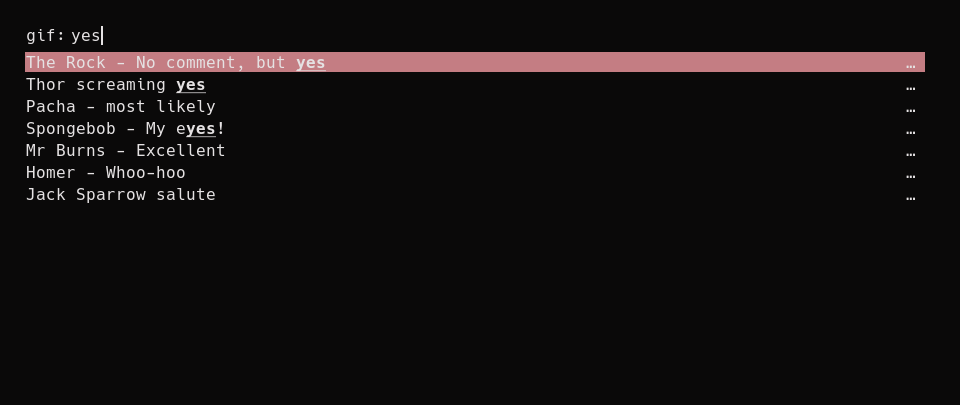

# rofi-gif
Maintain your own local gif library and access it using [rofi](https://github.com/DaveDavenport/rofi).

## Overview

Born from frustration between services not having a built in gif searcher, or the gif search functionality not always giving good results, rofi-gif will integrate into the `rofi` launcher and give you access to a self curated gif library.

## Example

Full list of entries from file



Searching the entries



## Requirements

* PyYAML
* XSel

## Usage

Create a source file in the following format:
```yaml
$gif-url:
    description: A description of the gif you'll understand
    tags: (note - optional)
      - more
      - things
      - to
      - match
      - against
```

Edit the `config_file` variable in `rofi-gif.py` to point to your source file

Add `gif:/path/to/rofi-gif.py` to your rofi configuration file.

Example config:

```
rofi.modi:    window,run,gif:/home/mcarlton/bin/rofi-gif.py
```

After searching for and selecting a gif, it will be copied into your system clipboard using the `xsel` command.
